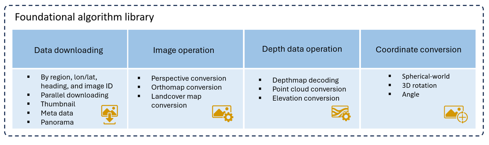

# Google Street View Panorama Processing Library

A comprehensive Python library for downloading, processing, and analyzing street view images with depth data, coordinate transformation, and 3D point cloud generation. Currently it supports Google Street View panoramas.



Jupyter Notebook Example: [street_view_image_toolkit_usage.ipynb](street_view_image_toolkit_usage.ipynb)

## Table of Contents
- [Installation](#installation)
- [Quick Start](#quick-start)
- [Core Concepts](#core-concepts)
- [Main Functions](#main-functions)
- [Usage Examples](#usage-examples)
- [Processing Samples](#processing-samples)
- [API Reference](#api-reference)

## Installation

### Requirements
```bash
pip install numpy scipy pillow scikit-image opencv-python
pip install pyproj geopy shapely fiona geopandas pandas
pip install pykrige matplotlib requests pyyaml tqdm
```

### Basic Setup
```python
from pano import GSV_pano
import os

# Set your working directory
saved_path = os.getcwd()
```

## Quick Start

### Download a panorama by coordinates from Google Street View
```python
from pano import GSV_pano

# Initialize with latitude and longitude
pano = GSV_pano(request_lat=34.0718606, request_lon=-84.357893, saved_path='./output')

# Download panorama image (zoom levels: 0-5, higher = more detail)
pano.get_panorama(zoom=3)

# Get depth map
depthmap = pano.get_depthmap(zoom=1)
```

### Download a panorama by PanoID
```python
# If you already have a panorama ID
panoId = 'bqqp1YWfr02XC4s1R577qA'
pano = GSV_pano(panoId=panoId, saved_path='./output')
pano.get_panorama(zoom=4)
```

## Core Concepts

### 1. GSV_pano Class
The main class for handling Google Street View panoramas. It provides:
- **Data downloading**: JSON metadata, panorama images, depth maps
- **Image operations**: Panorama conversion, perspective clipping, thumbnail extraction
- **Depth data**: Depthmap decoding, point cloud generation, ground detection
- **Coordinate conversion**: Spherical-world coordinate transformation, elevation handling

### 2. Coordinate Systems
- **WGS84 (EPSG:4326)**: Standard lat/lon coordinates
- **Local CRS**: Project-specific coordinate system (e.g., State Plane)
- **Spherical coordinates**: Theta (elevation) and Phi (azimuth) angles
- **Image coordinates**: Row/column pixel positions

### 3. Zoom Levels
- **Zoom 0**: 512×256 (lowest resolution)
- **Zoom 1**: 1024×512
- **Zoom 2**: 2048×1024
- **Zoom 3**: 4096×2048
- **Zoom 4**: 8192×4096
- **Zoom 5**: 13312×6656 (highest, not always available)

## Main Functions

### Initialization Methods

#### 1. By Panorama ID
```python
pano = GSV_pano(panoId='your_pano_id', saved_path='./output')
```

#### 2. By Coordinates
```python
pano = GSV_pano(request_lat=40.7484, request_lon=-73.9857, saved_path='./output')
```

#### 3. By JSON File
```python
pano = GSV_pano(json_file='path/to/panoId.json')
```

### Data Downloading

#### get_panorama()
Download panorama image at specified zoom level.

```python
# Parameters:
# - zoom: int (0-5), resolution level
# - prefix: str, filename prefix
# - suffix: str, filename suffix
# - check_size: bool, verify image dimensions
# - skip_exist: bool, skip if file exists

pano_data = pano.get_panorama(zoom=4)
# Returns: {'image': numpy_array, 'zoom': int}
```

#### get_depthmap()
Extract and process depth information.

```python
# Parameters:
# - zoom: int, resolution level for depthmap
# - saved_path: str, optional save location

depthmap_data = pano.get_depthmap(zoom=1)
# Returns: {
#   'depthMap': numpy_array,        # Distance in meters
#   'dm_mask': numpy_array,         # Valid depth mask
#   'ground_mask': numpy_array,     # Ground surface mask
#   'normal_vector_map': numpy_array,  # Surface normals
#   'plane_idx_map': numpy_array,   # Plane segmentation
#   'zoom': int
# }
```

### 3D Point Cloud Generation

#### get_point_cloud()
Generate 3D point cloud from depth data.

```python
# Parameters:
# - zoom: int, resolution level
# - distance_threshold: float, max distance in meters (default: 40)
# - color: bool, include RGB colors
# - saved_path: str, optional save location

point_cloud = pano.get_point_cloud(zoom=0, distance_threshold=40, color=True)
# Returns: {
#   'point_cloud': numpy_array (N×10),  # X, Y, Z, distance, R, G, B, plane_idx, normal_x, normal_y, normal_z
#   'zoom': int,
#   'dm_mask': numpy_array
# }
```

#### get_ground_points()
Extract ground surface points only.

```python
# Parameters:
# - zoom: int, resolution level
# - color: bool, include RGB/segmentation colors
# - img_type: str, 'pano' or 'seg' (segmentation)

ground_pts = pano.get_ground_points(zoom=1, color=True, img_type='pano')
# Returns: numpy_array (N×7) - X, Y, Z, distance, R, G, B
```

### Digital Elevation Model (DEM)

#### get_DEM()
Generate Digital Elevation Model from ground points using Kriging interpolation.

```python
# Parameters:
# - width: float, DEM width in meters (default: 40)
# - height: float, DEM height in meters (default: 40)
# - resolution: float, pixel size in meters (default: 0.4)
# - dem_coarse_resolution: float, interpolation grid size (default: 0.8)
# - zoom: int, depthmap zoom level (default: 1)
# - smooth_sigma: float, Gaussian smoothing sigma (default: 1)

DEM = pano.get_DEM(width=40, height=40, resolution=0.05, zoom=1)
# Returns: {
#   'DEM': numpy_array,           # Elevation grid
#   'resolution': float,
#   'central_x': float,          # Center X in local CRS
#   'central_y': float,          # Center Y in local CRS
#   'camera_height': float,      # Camera height above ground
#   'zoom': int
# }
```

### Digital Orthophoto Map (DOM)

#### get_DOM()
Generate orthorectified top-down image.

```python
# Parameters:
# - width: float, DOM width in meters (default: 40)
# - height: float, DOM height in meters (default: 40)
# - resolution: float, pixel size in meters (default: 0.03)
# - zoom: int, panorama zoom level (default: 3)
# - img_type: str, 'DOM' (panorama) or 'segmentation'
# - fill_clipped_seg: bool, fill clipped areas in segmentation

DOM = pano.get_DOM(width=40, height=40, resolution=0.05, zoom=4, img_type='DOM')
# Returns: {
#   'DOM': numpy_array,           # Orthophoto image
#   'resolution': float,
#   'central_x': float,
#   'central_y': float
# }
```

### Perspective Image Clipping

#### clip_pano()
Extract perspective view from panorama.

```python
# Parameters:
# - to_theta: float, pitch angle in degrees (vertical)
# - to_phi: float, yaw angle in degrees (horizontal)
# - width: int, output width in pixels (default: 1024)
# - height: int, output height in pixels (default: 768)
# - fov_h_deg: float, horizontal field of view (default: 90)
# - zoom: int, panorama zoom level
# - img_type: str, 'pano' or 'depthmap'
# - saved_path: str, save directory

clipped_img = pano.clip_pano(to_theta=0, to_phi=90, width=1024,
                              height=768, fov_h_deg=90, zoom=5)
```

#### getImagefrmAngle()
Download perspective view directly from Google servers.

```python
# Parameters:
# - saved_path: str, save directory
# - prefix: str, filename prefix
# - suffix: str, filename suffix
# - width: int, max 1024
# - height: int, max 768
# - pitch: float, vertical angle (-90 to 90)
# - yaw: float, horizontal angle (0 to 360)
# - fov: float, field of view (default: 90)

img, filename = pano.getImagefrmAngle(saved_path='./output',
                                       width=1024, height=768,
                                       pitch=0, yaw=90, fov=90)
```

### Coordinate Transformations

#### col_row_to_points()
Convert pixel coordinates to 3D world coordinates.

```python
# Parameters:
# - arr_col: numpy_array, column indices
# - arr_row: numpy_array, row indices
# - zoom: int, zoom level

points_3d = pano.col_row_to_points(arr_col, arr_row, zoom=3)
# Returns: numpy_array (N×4) - X, Y, Z, distance
```

#### XYZ_to_spherical()
Convert 3D coordinates to spherical angles.

```python
# Parameters:
# - XYZs: numpy_array (N×3), 3D coordinates

theta, phi = pano.XYZ_to_spherical(XYZs)
# Returns: theta (elevation), phi (azimuth) in radians
```

## Usage Examples

### Example 1: Download Panoramas from Coordinates

```python
from pano import GSV_pano

# Define location
lat, lon = 40.7484, -73.9857
saved_path = './new_york_panoramas'

# Initialize and download
pano = GSV_pano(request_lat=lat, request_lon=lon, saved_path=saved_path)

if pano.panoId != 0:
    # Download high-resolution panorama
    pano.get_panorama(zoom=5)

    # Download depth map
    depthmap = pano.get_depthmap(zoom=1)

    print(f"Downloaded panorama: {pano.panoId}")
    print(f"Location: {pano.lat}, {pano.lon}")
else:
    print("No panorama found at this location")
```

### Example 2: Generate 3D Point Cloud

```python
from pano import GSV_pano
import numpy as np

panoId = 'BM1Qt23drK3-yMWxYfOfVg'
pano = GSV_pano(panoId=panoId, saved_path='./output')

# Get colored point cloud
point_cloud_data = pano.get_point_cloud(zoom=1, distance_threshold=30, color=True)
points = point_cloud_data['point_cloud']

# Extract coordinates and colors
xyz = points[:, 0:3]  # X, Y, Z coordinates
rgb = points[:, 4:7]  # R, G, B colors
distances = points[:, 3]  # Distances from camera

# Filter points within 20 meters
nearby_points = points[distances < 20]

print(f"Total points: {len(points)}")
print(f"Points within 20m: {len(nearby_points)}")

# Save to file (e.g., for visualization with CloudCompare)
np.savetxt('point_cloud.txt', points[:, :7],
           fmt='%.4f', delimiter=',',
           header='X,Y,Z,Distance,R,G,B')
```

### Example 3: Create Digital Elevation Model (DEM)

```python
from pano import GSV_pano
from PIL import Image
import matplotlib.pyplot as plt

panoId = 'your_pano_id'
pano = GSV_pano(panoId=panoId, crs_local=6487, saved_path='./output')

# Generate DEM
DEM = pano.get_DEM(width=40, height=40, resolution=0.1, zoom=1)

# Visualize elevation
plt.figure(figsize=(10, 10))
plt.imshow(DEM['DEM'], cmap='terrain')
plt.colorbar(label='Elevation (m)')
plt.title(f"Digital Elevation Model\nCamera height: {DEM['camera_height']:.2f}m")
plt.savefig('dem_output.png', dpi=300)
plt.show()

print(f"DEM shape: {DEM['DEM'].shape}")
print(f"Resolution: {DEM['resolution']}m/pixel")
print(f"Camera height: {DEM['camera_height']:.2f}m")
```

### Example 4: Generate Orthophoto (DOM)

```python
from pano import GSV_pano
from PIL import Image

panoId = 'your_pano_id'
pano = GSV_pano(panoId=panoId, crs_local=6487, saved_path='./output')

# Download panorama first
pano.get_panorama(zoom=4)

# Generate orthophoto
DOM = pano.get_DOM(width=40, height=40, resolution=0.05,
                   zoom=4, img_type='DOM')

# Save as image
img = Image.fromarray(DOM['DOM'].astype('uint8'), 'RGB')
img.save('orthophoto.tif')

print(f"DOM shape: {DOM['DOM'].shape}")
print(f"Coverage: {40}m × {40}m at {0.05}m/pixel")
```

### Example 5: Extract Ground Surface Points

```python
from pano import GSV_pano
import numpy as np

panoId = 'your_pano_id'
pano = GSV_pano(panoId=panoId, saved_path='./output')

# Get ground points with colors
ground_points = pano.get_ground_points(zoom=1, color=True, img_type='pano')

# Ground points include: X, Y, Z, distance, R, G, B
print(f"Found {len(ground_points)} ground points")

# Analyze ground surface
elevations = ground_points[:, 2]
print(f"Ground elevation range: {elevations.min():.2f}m to {elevations.max():.2f}m")
print(f"Average ground height: {elevations.mean():.2f}m")

# Save ground points
np.savetxt('ground_points.txt', ground_points,
           fmt='%.4f', delimiter=',',
           header='X,Y,Z,Distance,R,G,B')
```

### Example 6: Extract Multiple Perspective Views

```python
from pano import GSV_pano

panoId = 'your_pano_id'
pano = GSV_pano(panoId=panoId, saved_path='./output')

# Get pano yaw (camera orientation)
pano_yaw = pano.jdata['Projection']['pano_yaw_deg']

# Extract views in 4 cardinal directions
directions = {
    'front': pano_yaw,
    'right': pano_yaw + 90,
    'back': pano_yaw + 180,
    'left': pano_yaw + 270
}

for name, yaw in directions.items():
    img, filename = pano.getImagefrmAngle(
        saved_path='./output',
        prefix=f'{panoId}_{name}',
        width=1024,
        height=768,
        pitch=0,
        yaw=yaw,
        fov=90
    )
    print(f"Saved {name} view: {filename}")
```

### Example 7: Process with Local Coordinate System

```python
from pano import GSV_pano

# Use local State Plane coordinate system
# Example: South Carolina FIPS 3900 (EPSG:6487)
panoId = 'your_pano_id'
pano = GSV_pano(panoId=panoId, crs_local=6487, saved_path='./output')

# Calculate local coordinates
pano.calculate_xy()
print(f"WGS84 coordinates: {pano.lat}, {pano.lon}")
print(f"Local coordinates: {pano.x:.2f}m, {pano.y:.2f}m")

# Generate DEM with local coordinates
DEM = pano.get_DEM(width=40, height=40, resolution=0.1)
print(f"DEM center (local): {DEM['central_x']:.2f}m, {DEM['central_y']:.2f}m")
```

## Processing Samples

The [process_samples.py](process_samples.py) file contains batch processing functions for large-scale operations.

### Example 8: Download Panoramas for Multiple Locations

```python
from process_samples import downoad_panoramas_from_panoId_list
import multiprocessing as mp

# Prepare list of panorama IDs
panoIds = ['panoId1', 'panoId2', 'panoId3', ...]
saved_path = './batch_download'

# Create multiprocessing list
panoIds_mp = mp.Manager().list()
for pid in panoIds:
    panoIds_mp.append(pid)

# Download with 6 processes
process_cnt = 6
pool = mp.Pool(processes=process_cnt)

for i in range(process_cnt):
    pool.apply_async(downoad_panoramas_from_panoId_list,
                     args=(panoIds_mp, saved_path, True, 4))
pool.close()
pool.join()
```

### Example 9: Download Panoramas in Geographic Area

```python
from process_samples import down_panos_in_area
import geopandas as gpd

# Load area of interest from shapefile
shape_file = 'path/to/area.shp'
AOI = gpd.read_file(shape_file).to_crs("EPSG:4326")
polygon = AOI.iloc[0].geometry

# Download panoramas within polygon
# col_cnt, row_cnt: create seed point grid
saved_path = './area_panoramas'
down_panos_in_area(
    polyon=polygon,
    saved_path=saved_path,
    col_cnt=100,  # Grid columns
    row_cnt=100,  # Grid rows
    json=True,    # Save JSON metadata
    pano=False,   # Don't download images (just metadata)
    process_cnt=10  # Number of parallel processes
)
```

### Example 10: Batch Generate DOMs from Segmentation

```python
from process_samples import get_DOM
import glob
import multiprocessing as mp

# Prepare segmentation files
seg_dir = './segmentation_images'
seg_files = glob.glob(f'{seg_dir}/*.png')
saved_path = './batch_doms'
resolution = 0.05

# Create multiprocessing list
seg_files_mp = mp.Manager().list()
for f in seg_files:
    seg_files_mp.append(f)

# Process with multiple cores
process_cnt = 4
pool = mp.Pool(processes=process_cnt)

for i in range(process_cnt):
    pool.apply_async(get_DOM,
                     args=(i, seg_files_mp, saved_path, resolution))
pool.close()
pool.join()
```

### Example 11: Extract Thumbnails in Multiple Directions

```python
from process_samples import _get_around_thumbnail_sp
import geopandas as gpd
import multiprocessing as mp

# Load panorama metadata
gdf = gpd.read_file('panoramas.shp')

# Prepare panoId and yaw angle pairs
panoIds_yaw = list(zip(gdf['panoId'].to_list(),
                       gdf['pano_yaw_d'].to_list()))

# Define shooting angles relative to camera direction
shoot_angles = [0, 45, 90, 135, 180, 225, 270, 315]
suffixes = ['F', 'FR', 'R', 'BR', 'B', 'BL', 'L', 'FL']

# Download thumbnails
saved_path = './thumbnails'
_get_around_thumbnail_sp(
    panoIds_yaw_list=panoIds_yaw,
    shoot_angle_list=shoot_angles,
    saved_path=saved_path,
    suffix=suffixes,
    width=1024,
    height=768,
    pitch=0,
    fov=90,
    overwrite=False
)
```

### Example 12: Download Time Machine (Historical) Panoramas

```python
from pano import GSV_pano

panoId = 'current_pano_id'
pano = GSV_pano(panoId=panoId, saved_path='./output')

# Download historical panoramas from 2013 onwards
pano.download_time_machine_jsons(
    saved_path='./historical',
    links=True,  # Also download linked panoramas
    oldest_year=2013,
    json_override=False
)
```

## API Reference

### GSV_pano Class Initialization

```python
GSV_pano(
    panoId=0,              # Panorama ID (22 characters)
    json_file='',          # Path to existing JSON file
    request_lon=None,      # Longitude for location search
    request_lat=None,      # Latitude for location search
    request_address='',    # Address (not fully implemented)
    crs_local=None,        # Local coordinate system EPSG code
    saved_path='',         # Directory to save outputs
    json_override=False    # Re-download JSON even if exists
)
```

### Key Attributes

```python
pano.panoId          # Panorama ID
pano.lon             # Longitude (WGS84)
pano.lat             # Latitude (WGS84)
pano.x               # X coordinate in local CRS
pano.y               # Y coordinate in local CRS
pano.jdata           # Complete JSON metadata
pano.depthmap        # Depth map dictionary
pano.panorama        # Panorama image dictionary
pano.point_cloud     # Point cloud dictionary
pano.DEM             # Digital Elevation Model dictionary
pano.DOM             # Digital Orthophoto Map dictionary
```

### Metadata Access

```python
# Camera orientation
pano.jdata['Projection']['pano_yaw_deg']    # Camera heading (0-360)
pano.jdata['Projection']['tilt_pitch_deg']  # Camera pitch
pano.jdata['Projection']['tilt_yaw_deg']    # Camera roll

# Location data
pano.jdata['Location']['panoId']
pano.jdata['Location']['lat']
pano.jdata['Location']['lng']
pano.jdata['Location']['elevation_wgs84_m']  # Elevation (WGS84)
pano.jdata['Location']['elevation_egm96_m']  # Elevation (EGM96)

# Image data
pano.jdata['Data']['tile_width']            # Tile size
pano.jdata['Data']['tile_height']
pano.jdata['Data']['level_sizes']           # Available zoom levels

# Adjacent panoramas
pano.jdata['Links']                         # List of connected panoramas

# Historical data
pano.jdata['Time_machine']                  # Historical panoramas
pano.jdata['model']['depth_map']            # Encoded depth data
```

### Utility Functions (from process_samples.py)

```python
# Batch downloading
download_pano(latlon_list, saved_path)
downoad_panoramas_from_panoId_list(panoId_list, saved_path, depthmap, zoom)
downoad_panoramas_from_json_list(json_file_list, saved_path, zoom)

# Area-based downloading
down_panos_in_area(polygon, saved_path, col_cnt, row_cnt, json, pano, zoom, process_cnt)
download_panoramas_from_seed_points(seed_points, pending_panoIds, saved_path, polygon, max_step)

# Batch processing
get_DOM(pid_id, seg_files, saved_path, resolution)
quick_DOM()  # Fast DOM generation

# Thumbnail extraction
get_around_thumbnail_mp()
_get_around_thumbnail_sp(panoIds_yaw_list, shoot_angle_list, saved_path, suffix, width, height, pitch, fov)

# File management
dir_json_to_csv_list(json_dir, saved_name, sort)
collect_links_from_panoramas_mp(json_dir, process_cnt)
```

## Tips and Best Practices

1. **Zoom Level Selection**:
   - Use zoom=0-1 for depth maps (faster processing)
   - Use zoom=3-4 for panoramas (good balance)
   - Use zoom=5 only when highest detail is needed (slow, not always available)

2. **Memory Management**:
   - Process large batches using multiprocessing
   - Clear unused data: `pano.panorama['image'] = None`
   - Use `json_override=False` to avoid re-downloading

3. **Coordinate Systems**:
   - Always specify `crs_local` for accurate DEM/DOM generation
   - Use appropriate State Plane or UTM zones for your region

4. **Distance Thresholds**:
   - For DEMs: typically 20-40 meters works well
   - For point clouds: filter by distance to remove noise
   - Ground detection uses `GROUND_VECTOR_THRES=10` (normal vector Z component)

5. **Error Handling**:
   - Always check `if pano.panoId != 0` before processing
   - Not all locations have panoramas available
   - Some panoramas may lack depth data

6. **Performance**:
   - Use multiprocessing for batch operations
   - Download JSONs first, then panoramas/depthmaps
   - Consider using lower resolutions for initial testing

## Troubleshooting

**No panorama found**:
- Check internet connection
- Verify coordinates are correct (lat, lon order)
- Location may not have Street View coverage

**Missing depth data**:
- Some older panoramas lack depth maps
- Try a nearby panorama

**Memory errors**:
- Reduce zoom level
- Process in smaller batches
- Use multiprocessing to isolate memory usage

**Coordinate transformation errors**:
- Verify CRS EPSG code is correct
- Ensure pyproj is installed correctly

## References

- Google Maps Street View: https://developers.google.com/maps/documentation/javascript/streetview
- Coordinate systems: https://epsg.io/
- Point cloud visualization: CloudCompare, MeshLab, or pptk


